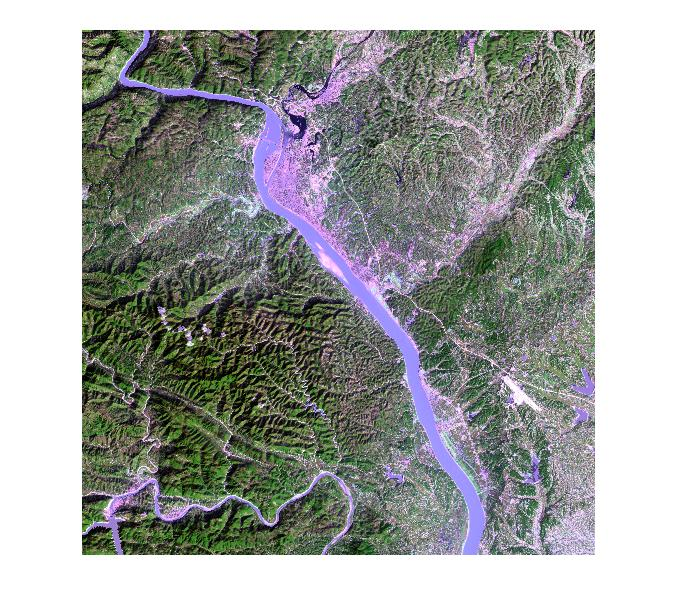

# 图像融合
@(Tutorial)[[Code Repository](https://github.com/JinlongLi2016/RemoteSensingImageProcessor/tree/master/2%20merge%20Fusion)| [Detail Explanation](http://www.baike.com/wiki/%E5%9B%BE%E5%83%8F%E8%9E%8D%E5%90%88)|[《遥感图像原理》]]

## 什么是图像融合？

>图像融合（Image Fusion）是指将多源信道所采集到的关于同一目标的图像数据经过图像处理和计算机技术等，最大限度的提取各自信道中的有利信息，最后综合成高质量的图像，以提高图像信息的利用率、改善计算机解译精度和可靠性、提升原始图像的空间分辨率和光谱分辨率，利于监测。 ---- 互动百科

##主要方法
* 加权融合
* 基于IHS变换
* 基于PCA(K-L) 变换
* 基于小波变换
* 比变换
* 乘积变换
##原始图像
左侧为**全色**图像 右侧为**多光谱**图像
<table><tr>
<td></td>
<td></td>
</tr></table>

##代码说明

unfinshed...
##合成影像
###加权融合

###比值融合

###乘积融合

##图像评估
###熵与

